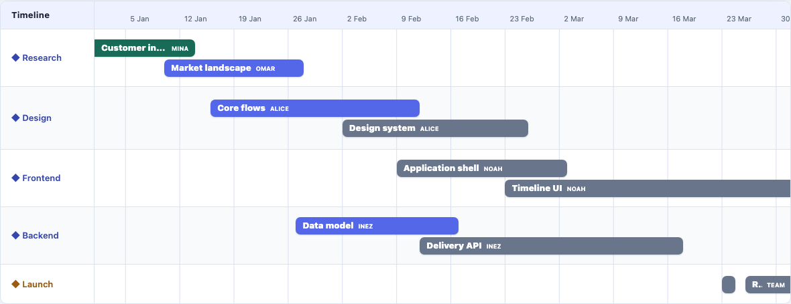

# Chronaxis

Framework-agnostic timelines for the web.

Chronaxis is a TypeScript library for interactive timeline and chart-style interfaces, usable directly in the browser or through a thin React adapter. Its framework-independent core keeps time, layout, and viewport logic separate from DOM rendering.

[](https://www.npmjs.com/package/@chronaxis/browser)
[](https://www.npmjs.com/package/@chronaxis/browser)



## Why Chronaxis?

- **Framework-agnostic by design.** `@chronaxis/core` owns time, layout, and viewport math without depending on the DOM or a UI framework.
- **A real browser API.** Use `@chronaxis/browser` directly from vanilla TypeScript or JavaScript; React is optional.
- **A thin React adapter.** `@chronaxis/react` manages the same browser timeline instance instead of maintaining a separate implementation.
- **Interactive and accessible by default.** Pan, zoom, selection, keyboard activation, typed events, and focus handling are built in.
- **Customizable without giving up structure.** Customize item content, row labels, classes, tick formatting, and visual variables while Chronaxis retains geometry, interaction, and accessibility ownership.
- **Built with large timelines in mind.** Horizontal culling and keyed DOM reuse are part of the renderer, and the development harness profiles datasets of up to 10,000 items.

> Chronaxis is currently `0.x`. The main data, layout, browser-instance, event, and React component APIs are intended for public use, while DOM customization callbacks, exact renderer structure, and React creation-time configuration may evolve with feedback.

## Features

- Millisecond, `Date`, and ISO-string time inputs
- Responsive DOM/SVG rendering with horizontal item culling and keyed DOM reuse
- Optional overlap-aware stack lanes with automatic row growth; legacy overlays remain the default
- Pointer pan, Ctrl/Cmd-wheel zoom, imperative navigation, and fit-to-data
- Single selection, keyboard activation, focus handling, and typed events
- Atomic row/item replacement without implicitly changing the viewport
- DOM content callbacks, CSS hooks, and a small set of CSS custom properties
- No third-party runtime dependencies in core or browser

## Packages

| Package | Purpose |
| --- | --- |
| [`@chronaxis/core`](https://www.npmjs.com/package/@chronaxis/core) | Pure normalization, scale, ruler, layout, and viewport math |
| [`@chronaxis/browser`](https://www.npmjs.com/package/@chronaxis/browser) | Browser renderer, interactions, lifecycle, styles, and imperative API |
| [`@chronaxis/react`](https://www.npmjs.com/package/@chronaxis/react) | Declarative React 18.2–19 adapter with an imperative ref |

## Installation

Vanilla TypeScript or JavaScript:

```sh
npm install @chronaxis/browser
```

React:

```sh
npm install @chronaxis/react @chronaxis/browser
```

Chronaxis is ESM-only. The browser and React packages require DOM typings when used from TypeScript.

## Vanilla JavaScript / TypeScript

```ts
import { createTimeline, type TimelineItem, type TimelineRow } from '@chronaxis/browser';
import '@chronaxis/browser/styles.css';

const rows: TimelineRow[] = [{ id: 'delivery', label: 'Delivery' }];
const items: TimelineItem[] = [{
  id: 'implementation',
  rowId: 'delivery',
  start: '2026-01-05',
  end: '2026-02-20',
  label: 'Implementation',
}];

const timeline = createTimeline(document.querySelector('#timeline')!, {
  range: { start: '2026-01-01', end: '2026-04-01' },
  rows,
  items,
});

timeline.zoomIn();
// Call timeline.destroy() before permanently removing the host.
```

Give the host a meaningful width. Chronaxis calculates its own height from the ruler and rows.

## React

```tsx
import { useRef } from 'react';
import { Timeline, type TimelineInstance, type TimelineItem } from '@chronaxis/react';
import '@chronaxis/browser/styles.css';

interface TaskData { owner: string }

const ref = useRef<TimelineInstance<TaskData>>(null);
const items: TimelineItem<TaskData>[] = [/* ... */];

<Timeline<TaskData>
  ref={ref}
  aria-label="Project timeline"
  style={{ height: 500 }}
  rows={rows}
  items={items}
  initialRange={{ start: '2026-01-01', end: '2026-04-01' }}
  onItemClick={({ item }) => console.log(item.data?.owner)}
/>
```

`rows`, `items`, event handlers, and DOM customization callbacks are reactive. `initialRange`, `viewport`, `interactions`, `overlap`, and geometry options are creation-time props; changing them after mount does not recreate or reconfigure the instance. Range and selection are owned by Chronaxis and can be observed through events or changed through the forwarded `TimelineInstance` ref. Ordinary safe `div` attributes are passed to the outer element.

## Data model

Rows require unique, non-empty `id` values and labels. Items require a unique `id`, a valid `rowId`, ordered `start`/`end` values, and may include a label and generic application data. Inputs are copied and time values are normalized to numeric timestamps at the package boundary.

```ts
interface TimelineRow {
  id: string;
  label: string;
  height?: number;
}

interface TimelineItem<T = unknown> {
  id: string;
  rowId: string;
  start: number | Date | string;
  end: number | Date | string;
  label?: string;
  data?: T;
}
```

## Overlapping items

Chronaxis preserves the `0.1.x` overlay behavior by default. That is useful when overlays are intentional, but same-row bars that overlap in time also share pointer pixels. For concurrent work, opt into stack layout at creation time:

```ts
const timeline = createTimeline(container, {
  range: { start: '2026-01-01', end: '2026-04-01' },
  rows,
  items,
  overlap: {
    mode: 'stack',
    laneGap: 4, // optional; 4px is the default in stack mode
  },
});
```

`stack` assigns lanes independently within each row, so temporally overlapping items receive separate vertical hit targets. Normal ranged items whose intervals only touch (`A.end <= B.start`) may reuse a lane. A zero-duration point at `t` collides with points and ranges that begin at `t`, as well as ranges that contain `t`; it may reuse a lane with a range ending at `t`. Lanes are deterministic—ties are ordered by start time, end time, then source input order—and are calculated from the complete row data before horizontal culling, so pan and zoom never reshuffle visible items vertically.

The configured row height remains a minimum. A stacked row grows to fit the configured `itemHeight`, every needed lane, and the lane gaps; it does not shrink an item simply because the base row is shorter. `laneGap` must be a finite number greater than or equal to zero. A custom row `height` is likewise a minimum in stack mode. Overlay mode retains its original row and item geometry, including its existing effective-height clamp.

In React, pass the same creation-time configuration:

```tsx
<Timeline
  rows={rows}
  items={items}
  initialRange={{ start: '2026-01-01', end: '2026-04-01' }}
  overlap={{ mode: 'stack' }}
/>
```

Changing `overlap` after mount does not reconfigure an existing `Timeline`; remount it when a different creation-time layout policy is required.

## Navigation

The browser instance exposes:

- `setRange(range)` and `getRange()` to write/read the viewport; returned ranges use numeric timestamps.
- `fit()` to fit all current items without changing data.
- `zoomIn()` and `zoomOut()` to zoom around the center.
- `scrollTo(time, { align })` to place a time at `start`, `center`, or `end`.

Pointer dragging pans the plot. Wheel zoom requires Ctrl/Cmd by default so ordinary page scrolling is preserved. Configure creation-time behavior with `interactions.pan` and `interactions.wheelZoom`; configure interactive duration bounds with `viewport.minZoomDuration` and `viewport.maxZoomDuration`.

## Selection and events

Use `selectItem(id)`, `clearSelection()`, and `getSelectedItemId()` for single selection. Selecting an unknown ID throws. `on(type, handler)` returns an unsubscribe function and supports:

| Event | Payload and timing |
| --- | --- |
| `rangeChange` | Normalized `range` and operation `source`; emitted after rendering and coalesced within an animation frame |
| `selectionChange` | Selected normalized item or `null`, plus `pointer`, `keyboard`, `api`, or `data` source; emitted synchronously |
| `itemClick` | Activated normalized item; emitted for pointer, Enter, or Space activation |

Item snapshots are immutable views and preserve the generic `data` type.

## Dynamic data updates

- `setItems(items)` validates items against the current rows.
- `setRows(rows)` rejects rows that would orphan current items.
- `setData({ rows, items })` validates and commits both collections atomically.

Data changes preserve the viewport; call `fit()` explicitly when desired. Removing the selected item clears selection. Failed updates leave the previous state intact. `destroy()` removes DOM, listeners, observers, scheduled work, and subscriptions; later mutations become safe no-ops.

## Custom rendering

`renderItem`, `renderRowLabel`, `formatTick`, `getItemClassName`, and `getRowClassName` are creation options in browser and reactive props in React. Content callbacks return a DOM `Node`, text string, or `null`; they are not framework render functions.

Chronaxis owns item geometry, wrapper identity, focusability, ARIA state, selection, and interaction. Consumers own only the contents and optional classes. React elements and portals are not supported by these low-level callbacks. Keep callbacks presentational and free of side effects because invocation counts may change as rendering is optimized.

## Styling and theming

Import the base stylesheet once:

```ts
import '@chronaxis/browser/styles.css';
```

All library selectors are scoped to `.chronaxis`. Stable hooks include `.chronaxis-ruler`, `.chronaxis-row`, `.chronaxis-row-label`, `.chronaxis-item`, and `.chronaxis-item--selected`. Identity is available through `data-chronaxis-item-id` and `data-chronaxis-row-id`.

The supported visual variables are `--chronaxis-font-family`, `--chronaxis-font-size`, `--chronaxis-background`, `--chronaxis-text-color`, `--chronaxis-muted-text-color`, `--chronaxis-border-color`, `--chronaxis-grid-color`, `--chronaxis-row-border-color`, `--chronaxis-row-alt-background`, `--chronaxis-ruler-background`, `--chronaxis-ruler-border-color`, `--chronaxis-item-background`, `--chronaxis-item-text-color`, `--chronaxis-item-border-color`, `--chronaxis-item-border-radius`, `--chronaxis-item-selected-outline`, and `--chronaxis-focus-ring`. Every variable has a fallback in the base stylesheet and none changes layout geometry.

## Accessibility

Items expose button semantics, accessible names, `aria-pressed`, keyboard Enter/Space activation, and visible focus. The SVG grid is hidden from assistive technology. Applications should provide an `aria-label` or other accessible name for the timeline host and maintain sufficient contrast when overriding theme colors or rendering custom content.

The browser suite runs automated axe checks, but Chronaxis does not claim formal WCAG conformance. There are no animations, so reduced-motion handling is not currently necessary.

## Browser support

Chronaxis targets current evergreen Chromium, Firefox, and WebKit browsers. It relies on `ResizeObserver`, Pointer Events, `requestAnimationFrame`, and `Intl.DateTimeFormat`; no legacy-browser polyfills are included.

`@chronaxis/core`, `@chronaxis/browser/runtime`, and `@chronaxis/react` can be imported in Node without DOM globals. The default browser entry imports CSS and is intended for bundlers; mounting still requires a browser.

## Performance

The layout engine horizontally culls off-screen items and the browser renderer reuses DOM by stable ID. Stack lane assignment still runs from complete row data before culling, while only horizontally visible items enter the DOM. The development harness covers 100, 1,000, 5,000, and 10,000-item datasets at low, moderate, and heavy overlap densities, plus a one-row pathological-overlap case. It can compare overlay and stack core-layout references alongside public operation-to-paint timing. Results depend mainly on visible content, browser, hardware, and custom renderer complexity and are not performance guarantees. See [the Phase 6 benchmark report](docs/performance-phase-6.md) for methodology and recorded measurements.

## Architecture

```text
@chronaxis/core
      ↑
@chronaxis/browser
      ↑
@chronaxis/react

data
  ↓
layout / lanes / geometry
  ↓
scene
  ↓
browser rendering
```

Core has no DOM dependency. Browser converts core scenes into interactive DOM/SVG. React manages one browser instance without moving viewport state through React renders.

## Development

```sh
npm install
npm test
npm run typecheck
npm run build
npm run test:browser
```

Use `npm run dev` for the vanilla example, `npm run dev:react` for React, and `npm run perf` for the developer benchmark. The [Phase 8 API inventory](docs/api-audit-phase-8.md) records the reviewed public surface.

Chronaxis is available under the [MIT License](LICENSE). See the [changelog](CHANGELOG.md) for release history.
